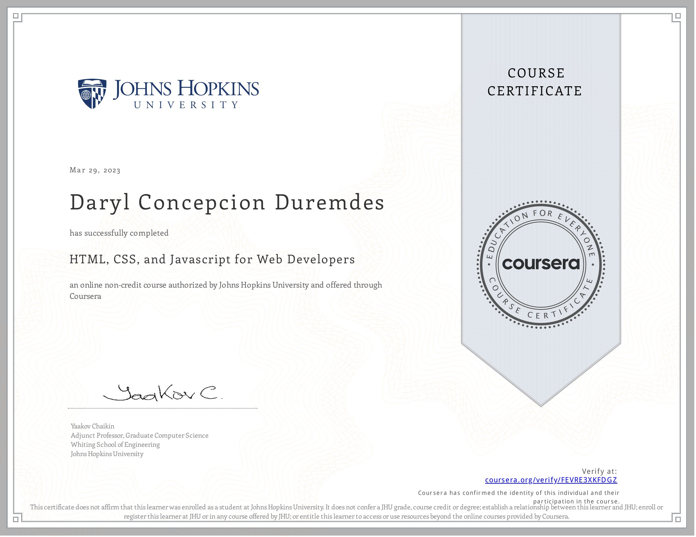

<a href="https://www.coursera.org/learn/html-css-javascript-for-web-developers/home/info" target="_blank">HTML, CSS, and Javascript for Web Developers</a>
 

<h5>by Johns Hopkins University</h5>

<xh5>About this Course</h5>

Do you realize that the only functionality of a web application that the user directly interacts with is through the web page? Implement it poorly and, to the user, the server-side becomes irrelevant! Today’s user expects a lot out of the web page: it has to load fast, expose the desired service, and be comfortable to view on all devices: from a desktop computers to tablets and mobile phones. 

In this course, we will learn the basic tools that every web page coder needs to know. We will start from the ground up by learning how to implement modern web pages with HTML and CSS. We will then advance to learning how to code our pages such that its components rearrange and resize themselves automatically based on the size of the user’s screen. You’ll be able to code up a web page that will be just as useful on a mobile phone as on a desktop computer. No “pinch and zoom” required! Last but certainly not least, we will get a thorough introduction to the most ubiquitous, popular, and incredibly powerful language of the web: Javascript. Using Javascript, you will be able to build a fully functional web application that utilizes Ajax to expose server-side functionality and data to the end user.

Taught by:Yaakov Chaikin, Adjunct Professor, Graduate Computer Science
Whiting School of Engineering

  

Website:

<a href="https://www.davidchuschinabistro.com/#/">DAVID CHU'S CHINA BISTRO</a>

<h4>Answers on Weekly Assignments</h4>

<a href="https://github.com/darylduremdes/module2-solution" target="_blank">module2-solution<a>

<a href="https://github.com/darylduremdes/module3-solution" target="_blank">module3-solution<a>

<a href="https://github.com/darylduremdes/module4-solution" target="_blank">module4-solution<a>

<a href="https://github.com/darylduremdes/module5-solution" target="_blank">module5-solution<a>

  
 
<h5>HTML, CSS, and Javascript for Web Developers</h5>
<h5>by Johns Hopkins University</h5>
<h5>Taught by: Yaakov Chaikin</h5>

Finished the course on March 29, 2023

 

  

  
  
  
  
  
  
  
  
  
  
